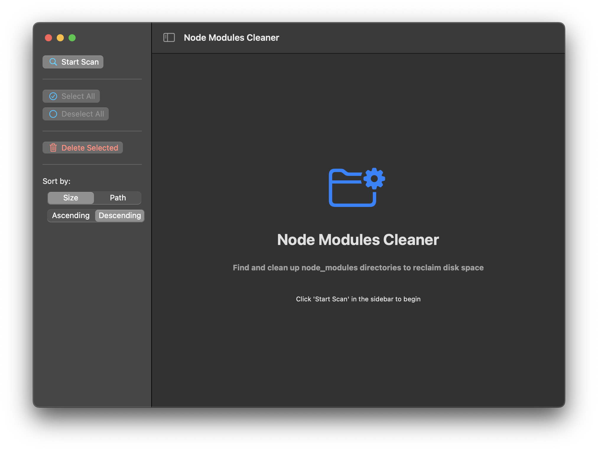

# Node Modules Cleaner

A powerful and intuitive desktop application designed to help developers efficiently manage their Node.js project dependencies. This tool automatically scans your system for `node_modules` directories, providing a comprehensive overview of all Node.js projects and their associated dependency folders. With its user-friendly interface, you can easily identify large `node_modules` folders, view their sizes, and selectively remove them to reclaim valuable disk space. Perfect for developers working with multiple Node.js projects or those looking to optimize their development environment.



## Features

- 🔍 Scans your system for `node_modules` directories
- 📊 Shows detailed information about each `node_modules` folder
- 🗑️ Selectively delete specific `node_modules` folders
- 📁 Supports multiple project locations
- 🚀 Fast and efficient scanning
- 🎯 Precise control over which folders to delete

## Installation

### Download the Latest Release

1. Visit the [Releases](https://github.com/yourusername/node-module-cleaner/releases) page
2. Download the latest version for your operating system
3. Extract the downloaded file

### Important: First Run Permission

After downloading the release, you'll need to grant the application permission to run on your device. Open Terminal and run the following command:

```bash
xattr -cr node-module-cleaner.app && mv node-module-cleaner.app /Applications/
```

This command removes any extended attributes that might prevent the app from running on macOS.

## Usage

1. Launch the Node Modules Cleaner application
2. Select the directories you want to scan for `node_modules` folders
3. Review the list of found `node_modules` directories
4. Select the folders you want to delete
5. Confirm the deletion

## Development

### Prerequisites

- Node.js (v14 or higher)
- npm or yarn

### Setup

```bash
# Clone the repository
git clone https://github.com/yourusername/node-module-cleaner.git

# Install dependencies
npm install

# Start the development server
npm start
```

## Contributing

Contributions are welcome! Please feel free to submit a Pull Request.

## License

This project is licensed under the MIT License - see the [LICENSE](LICENSE) file for details.

## Support

If you encounter any issues or have suggestions, please [open an issue](https://github.com/yourusername/node-module-cleaner/issues) on GitHub.